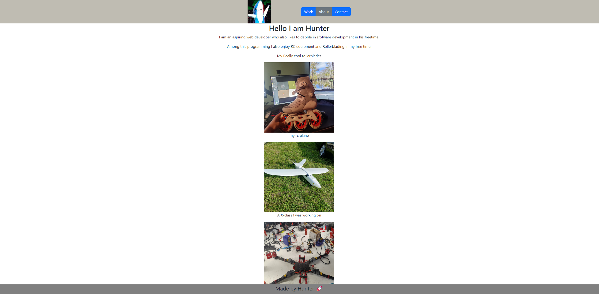

# React Portfolio

## Description

Just a place to demnostrate reactjs Knowledge always a work in progess.

## Table Of Cotents

- [Description](#description)
- [Installation And Usage](#installation)
- [Demo](#demo)

## Installation
To get this up and runing simply download the repo. Extract and navigate your command prompt to the folder. Your then going to want to run `npm i`. This will download all the require node modules. After that just navigate to the root folder of the repo and run `npm start`. 

## Demo

You can find a demnostration [here](http://mineboss.asuscomm.com:55673/).